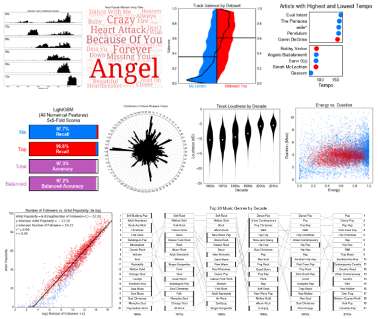
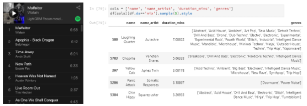
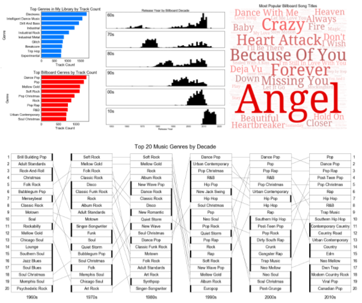
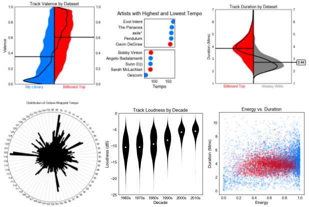
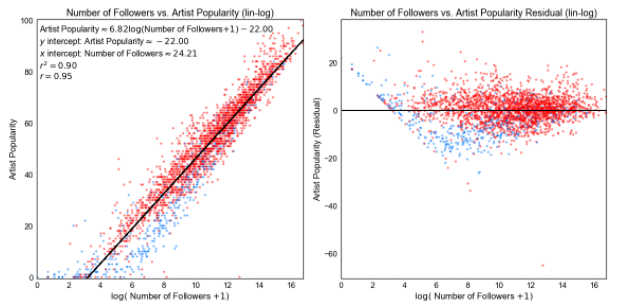
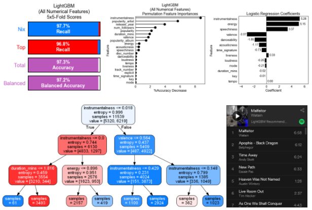

# Spotify Data Scraping, Deep Exploration, and Machine Learning Project

*Nix Barnett*

This project is an in-depth analysis of music from the music streaming service [Spotify](https://www.spotify.com/). In it, I scrape a large number of tracks from [my personal Spotify music library](https://open.spotify.com/user/nxbrnt/playlist/1ypVHzjgXq07PwQR7SBcGU?si=d56V5YZ-Q1y4FhiWzXN0gg) (~6000 tracks) as well as the [Billboard Year-End Hot 100](https://en.wikipedia.org/wiki/Billboard_Hot_100) from every year since 1960 (~6000 tracks) using [Spotify's Web API](https://developer.spotify.com/web-api/). After merging and wrangling this data into a usable dataframe, I thoroughly explore and visualize the tracks' features using extensively customized plotting functions. While my primary goal is to find predictive signals in the features that distinguish between the two datasets, I discover many interesting patterns along the way.

I then use these insights to build and test a number of classifiers that distinguish between these datasets *using only the track's audio features*. I use the best of these classifiers to build a personalized track recommender, and generate playlists of novel, recommended tracks.

## Tools 
The project is coded in **[Python](https://www.python.org/)** using **[JupyterLab](https://github.com/jupyterlab/jupyterlab)** notebooks. The **[spotipy](https://github.com/plamere/spotipy)** python package is used to interface with the **[Spotify Web API](https://developer.spotify.com/web-api/)**. The data is stored and transformed using primarily **[pandas](https://pandas.pydata.org/)** and **[NumPy](http://www.numpy.org/)**. All custom plots are designed using **[seaborn](https://seaborn.pydata.org/)**, **[Matplotlib](https://matplotlib.org/)**, and **[Bokeh](https://bokeh.pydata.org/en/latest/)**. **[Scikit-learn](http://scikit-learn.org)**, **[LightGBM](https://github.com/Microsoft/LightGBM)**, and **[eli5](https://github.com/TeamHG-Memex/eli5)** are used for classification, regression, and other machine learning tasks. All text is written in **[Markdown](https://daringfireball.net/projects/markdown/)**, with equations written in **[LaTeX](https://www.latex-project.org/)**.

## Model Classes and Methods
**Logistic regression**, **decision trees**, **random forest**, and **gradient boosted trees (LightGBM)** are used for classification. **Balanced accuracy** (macro-average recall) is used as the primary scoring metric. **Repeated k-fold stratified cross validation** is used for hyperparameter optimization and for reporting model generalization performance. **Permutation importance** (mean decrease accuracy) is used for determining feature importances.

---

## Sections

This project is written mostly in a tutorial format, and is broken into five Jupyter notebooks.

**Click on the titles or images to load the corresponding notebook. You can also easily navigate between the notebooks from *within* any notebook:**

# **[1. Data Scraping and Wrangling](spotify_1_scraping.ipynb)**

---

# **[2. Basic Feature Exploration](spotify_2_basic_exploration.ipynb)**

---

# **[3. Audio Feature Exploration](spotify_3_audio_features.ipynb)**

---

# **[4. Social Feature Exploration and Regression](spotify_4_popularity_and_followers.ipynb)**

---

# **[5. Building a Classifier and Track Recommender ](spotify_5_classifier_and_recommender.ipynb)**

---